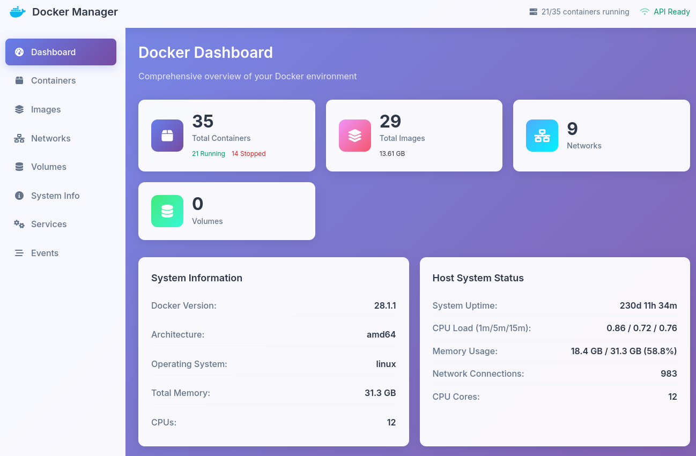

# Docker Manager

A comprehensive Docker management web interface built with Go.



## Build

```bash
go build -o docker-manager ./cmd/server
```

## Run

```bash
# Default port: 8080
./docker-manager

# Custom port
./docker-manager -port 9090
```

Access the interface at `http://localhost:8080` (or your configured port).
